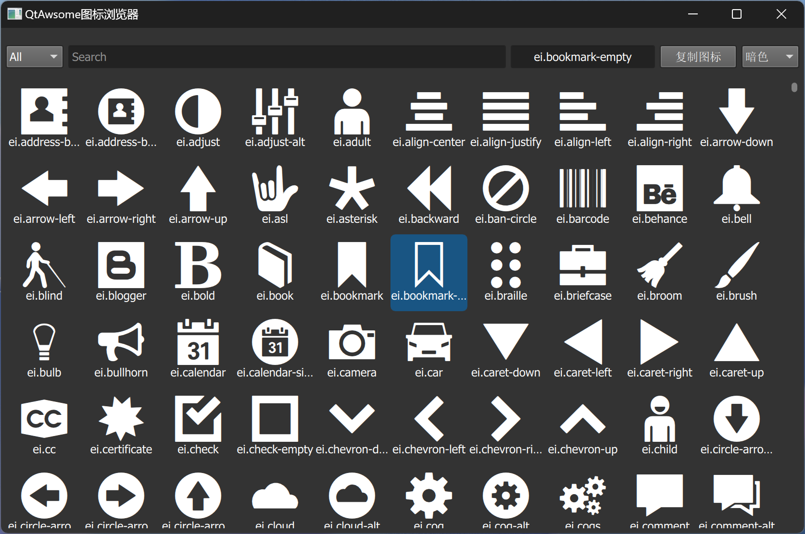
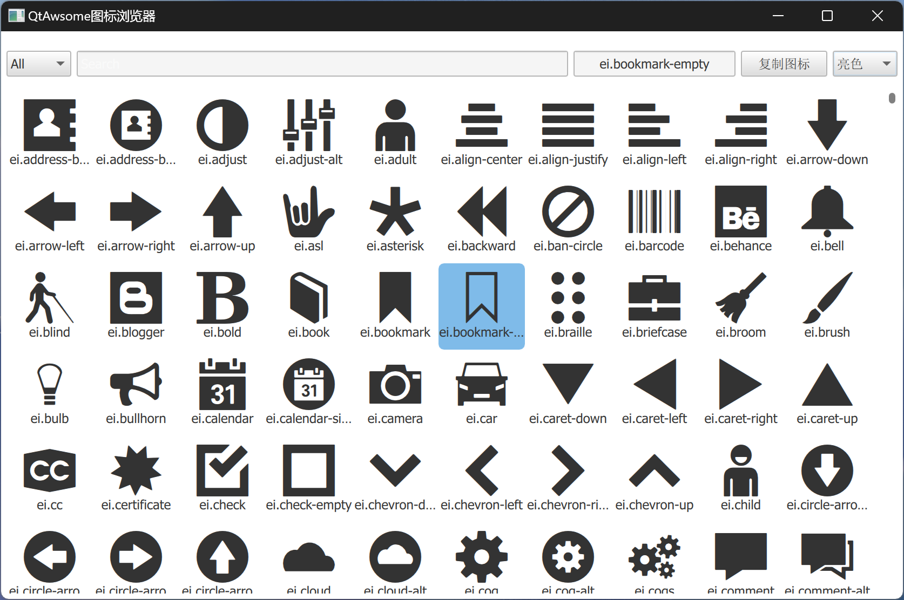
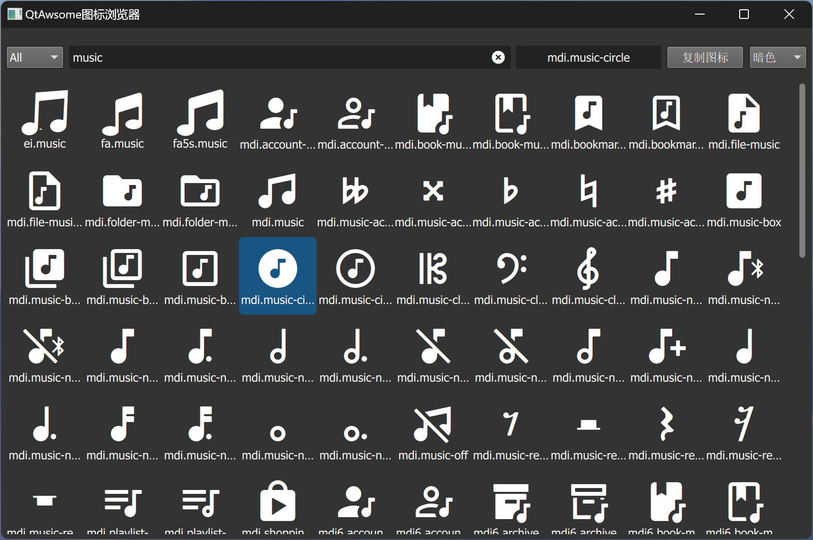

如何使用：

1. 定义IconFont类

   ```qml
   component IconFont: CF.Label {
       id: iconLbRoot
       property string name
       property int iconSize: 16
       onNameChanged: {
           iconLbRoot.font = iconfont.font(name.split(".")[0], iconSize)
           iconLbRoot.text = iconfont.charmap(name)
       }
       horizontalAlignment: Text.AlignHCenter
       verticalAlignment: Text.AlignVCenter
   }
   ```

2. 使用

   ```qml
   IconFont {
       name: "ei.address-book"
       iconSize: 48
       anchors.horizontalCenter: parent.horizontalCenter
   }
   ```

   






